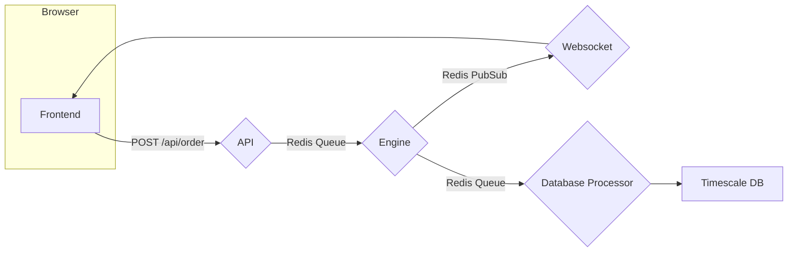

# API-Engine Architecture for Simulated Exchange

This project simulates a cryptocurrency exchange with a modular design for scalability and real-time updates. It focuses on the backend architecture and core exchange logic.

## Components

1.  **Frontend (Client):**
    *   Web interface for users to place orders and view market data.
    *   Communicates with the API Server using HTTP for order placement and WebSockets (or polling) for real-time updates.

2.  **API Server (Node.js with Express.js):**
    *   Handles incoming HTTP requests from the frontend for order placement.
    *   Performs request validation and authorization.
    *   Routes order placement requests to the Engine via a Redis queue.

3.  **Engine (Node.js):**
    *   Core logic of the exchange.
    *   Manages the order book .
    *   Implements the order matching algorithm .
    *   Executes the pseudo market maker logic (placing buy and sell orders).
    *   Publishes trade confirmations and order book updates to Redis pub/sub channels.
    *   Sends trade data to the TimescaleDB via a Redis queue and a Database Processor

4.  **WebSocket Server (Socket.io or ws - Optional):**
    *   Handles real-time communication with connected clients.
    *   Subscribes to relevant Redis pub/sub channels.
    *   Forwards messages to connected clients, providing real-time market data updates.

5.  **Redis:**
    *   In-memory data store used for asynchronous communication and message queuing.
    *   Used for:
        *   API Server to Engine communication (using Redis queues).
        *   Engine to WebSocket Server communication (using Redis pub/sub).
        * Engine to TimescaleDB communication (using Redis queues).

6. **TimescaleDB:**
   * Time series database used to store trade data.

7. **Database Processor:**
    * Takes data from redis queue and sends it to timescaleDB.

## Architecture Diagram



# Project Setup Instructions

## Steps to Start the Application

### 1. Navigate to the Project Directory
Open a terminal and navigate to the root directory of your project.

### 2. Start Docker Compose (Winding Up)
Ensure your `docker-compose.yml` file is in the appropriate directory. Use the following commands:

```bash
cd /docker  # Adjust this path if your docker-compose.yml file is located elsewhere

docker-compose up -d  # Starts all services in detached mode
```

### 3. Install Dependencies and Start Services (Serial Execution)
It's important to install dependencies and start services in a specific order.

#### a) API Service
```bash
cd api
npm install
npm run dev
cd ..  # Move back to project root
```
This installs dependencies and starts the API service in development mode.

#### b) Engine Service
```bash
cd engine
npm install
npm run dev
cd ..  # Move back to project root
```
Similar to the API service, this installs dependencies and starts the engine service.

#### c) WebSocket Service (WS)
```bash
cd ws
npm install
npm run dev
cd ..  # Move back to project root
```
Installs dependencies and starts the WebSocket service.

#### d) Frontend Service
```bash
cd frontend
npm install
npm run dev
cd ..  # Move back to project root
```
Installs dependencies and starts the frontend service.

#### e) Marketmaker Service
```bash
cd marketmaker
npm install
npm run dev
cd ..  # Move back to project root
```
Installs dependencies and starts the marketmaker service.

### 4. Access the Application
After completing the above steps, your entire application stack should be running in separate Docker containers. Access the application using the ports defined in your `docker-compose.yml` file.

---

## Additional Commands

### Stop All Running Containers
```bash
cd /docker  # Adjust this path if necessary
docker-compose down
```

### Restart All Services
```bash
cd /docker  # Adjust this path if necessary
docker-compose up -d
```

---

## Notes
- **Paths:** Update the paths in the commands if your project structure or the location of your `docker-compose.yml` file differs.
- **Environment Variables:** Ensure all required environment variables are set before starting the services.

---

## Example Project Structure
```
project-root/
├── docker/
│   └── docker-compose.yml
├── api/
├── engine/
├── ws/
├── frontend/
└── marketmaker/
```

---

## Troubleshooting
- **Container Not Starting:** Check logs using `docker-compose logs`.
- **Dependency Issues:** Ensure all `npm install` commands complete without errors.
